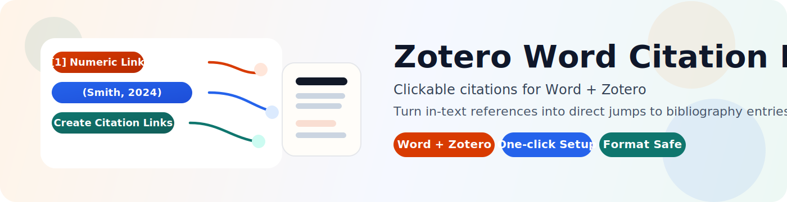

<p align="center">
  
</p>

<p align="center">
  
</p>

# Zotero Word Citation Links

> Add clickable citation-to-bibliography links to Zotero citations in Microsoft Word, without disrupting the normal Zotero writing workflow.

<p align="center">
  <a href="https://github.com/FFFxueGawaine/zotero-word-citation-links/releases/latest">
    
  </a>
  <a href="https://github.com/FFFxueGawaine/zotero-word-citation-links">
    
  </a>
  <a href="https://github.com/FFFxueGawaine/zotero-word-citation-links">
    
  </a>
  <a href="https://github.com/FFFxueGawaine/zotero-word-citation-links/blob/main/LICENSE">
    
  </a>
</p>

<p align="center">
  
</p>

Latest release: `v0.4.0`

Downloads:
- [Latest Release Page](https://github.com/FFFxueGawaine/zotero-word-citation-links/releases/latest)
- [Windows Installer](https://github.com/FFFxueGawaine/zotero-word-citation-links/releases/latest/download/zotero-word-links-installer.exe)
- [Windows Template Package](https://github.com/FFFxueGawaine/zotero-word-citation-links/releases/latest/download/zotero-word-links-windows-template.zip)
- [Mac Template Package](https://github.com/FFFxueGawaine/zotero-word-citation-links/releases/latest/download/zotero-word-links-mac-template.zip)

Changelog: [CHANGELOG.md](./CHANGELOG.md)

Jump to: [中文](#zh-cn) | [English](#en)

<a id="zh-cn"></a>

## 中文

[Switch to English](#en)

### 项目简介

这是一个给 `Microsoft Word + Zotero` 使用的小型增强工具。

它会在 Word 的 `Zotero` 选项卡中增加三个按钮：

- `Create Citation Links`
- `Remove Citation Links`
- `Set Link Color`

它的目标很简单：

- 让正文中的 Zotero 引文可以点击
- 点击后跳转到文末对应参考文献
- 尽量只改变引文颜色，不破坏原有字体、字号、粗斜体、上下标和段落格式

### 核心特点

| 特点 | 说明 |
| --- | --- |
| 支持数字编号格式 | 例如 `[1]`、`[2, 3]` |
| 支持作者-年份格式 | 例如 `(Smith, 2024)` |
| 入口直观 | 直接出现在 Word 的 `Zotero` 选项卡中 |
| 尽量保留原格式 | 创建链接时主要只改变颜色 |
| 可自定义链接颜色 | 可在 Word 内设置新的默认链接颜色 |
| 支持恢复 | 可以移除跳转，也可以恢复原始模板 |

### 支持情况

| 平台 | 状态 | 安装方式 |
| --- | --- | --- |
| Windows + Word | 正式支持 | 一键安装 / 直接复制预改模板 |
| Mac + Word | 实验性支持 | `.command` 一键安装 / 手工安装 |

### 安装前提

- 已安装 `Zotero`
- 已安装 `Microsoft Word`
- Word 中已经能看到官方 `Zotero` 选项卡

## Windows 安装

Windows 现在只保留两种面向用户的安装方式：

1. 一键安装
2. 手动直接复制预改模板

### 方法一：一键安装

这是默认推荐方式，适合大多数用户。

1. 关闭 `Word`
2. 下载并运行 [Windows Installer](https://github.com/FFFxueGawaine/zotero-word-citation-links/releases/latest/download/zotero-word-links-installer.exe)
3. 重新打开 `Word`
4. 打开 `Zotero` 选项卡
5. 确认出现：
   - `Create Citation Links`
   - `Remove Citation Links`
   - `Set Link Color`

### 方法二：手动直接复制预改模板

如果你更喜欢最简单、最直观的方式，可以直接覆盖预改好的 `Zotero.dotm`。

下载：

- [Windows Template Package](https://github.com/FFFxueGawaine/zotero-word-citation-links/releases/latest/download/zotero-word-links-windows-template.zip)

这个包里包含：

- 预改好的 `Zotero.dotm`
- `install_prebuilt_template.bat`
- `restore_prebuilt_template.bat`
- [windows/WINDOWS_TEMPLATE_INSTALL.md](./windows/WINDOWS_TEMPLATE_INSTALL.md)

你可以用两种方式：

#### 方式 A：运行模板包里的安装脚本

1. 解压 `zotero-word-links-windows-template.zip`
2. 关闭 `Word`
3. 双击 `install_prebuilt_template.bat`
4. 重新打开 `Word`
5. 检查 `Zotero` 选项卡里的三个按钮

#### 方式 B：自己手动复制覆盖

1. 关闭 `Word`
2. 备份当前模板：

```text
%APPDATA%\Microsoft\Word\STARTUP\Zotero.dotm
```

3. 将包内的 `Zotero.dotm` 覆盖到同一路径
4. 重新打开 `Word`
5. 检查 `Zotero` 选项卡中的按钮是否出现

详细说明：
[windows/WINDOWS_TEMPLATE_INSTALL.md](./windows/WINDOWS_TEMPLATE_INSTALL.md)

## Mac 安装

Mac 当前为实验性支持，推荐从模板包开始：

1. 下载 [Mac Template Package](https://github.com/FFFxueGawaine/zotero-word-citation-links/releases/latest/download/zotero-word-links-mac-template.zip)
2. 关闭 `Word`
3. 解压后双击：
   - `install_mac.command`
4. 如果 macOS 首次拦截，右键脚本并选择 `Open`
5. 等待脚本完成备份和安装
6. 重新打开 `Word`
7. 打开 `Zotero` 选项卡，确认出现：
   - `Create Citation Links`
   - `Remove Citation Links`
   - `Set Link Color`

详细说明：
[mac/MAC_INSTALL.md](./mac/MAC_INSTALL.md)

## 使用教程

### 第一步：正常写作

先按平时的 Zotero 用法写作：

1. 用 Zotero 插入正文引文
2. 用 Zotero 生成参考文献
3. 正常修改、补充、刷新引文

### 第二步：生成跳转

当你的文档已经有了正文引文和文末参考文献后：

1. 打开 Word 的 `Zotero` 选项卡
2. 点击 `Create Citation Links`
3. 文中引文会变成可点击状态
4. 点击引文，可跳转到对应参考文献

### 可选步骤：先设置链接颜色

如果你想把新建链接改成别的颜色，可以先：

1. 打开 Word 的 `Zotero` 选项卡
2. 点击 `Set Link Color`
3. 选择预设颜色，或输入自定义 `R,G,B`
4. 这个颜色会保存为默认值，并用于之后新创建的链接

注意：

- 这个设置不会自动重刷当前文档里已经生成好的链接
- 如果你想让当前文档改用新颜色，需要之后重新执行一次 `Create Citation Links`

### 第三步：需要时删除跳转

如果你想移除这次生成的跳转效果：

1. 点击 `Remove Citation Links`
2. 文中的跳转会被移除
3. 引文颜色会尽量恢复到创建前的状态

### 按钮说明

| 按钮 | 作用 | 什么时候用 |
| --- | --- | --- |
| `Create Citation Links` | 为文中 Zotero 引文创建跳转 | 当引文和参考文献已经准备好时 |
| `Remove Citation Links` | 移除本工具创建的跳转 | 当你想恢复普通显示或重新生成跳转时 |
| `Set Link Color` | 设置以后新建链接的默认颜色 | 当你想换成新的链接颜色时 |

### 推荐使用节奏

如果你想要最稳的体验，建议这样用：

1. 先完成 Zotero 的正常引文编辑
2. 如果你刚点过 `Zotero -> Refresh`，先不要急着测试跳转
3. 再点一次 `Create Citation Links`
4. 最后再检查点击跳转效果

原因很简单：

- `Zotero -> Refresh` 会重写 Word 中的引文结果
- 所以刷新之后，通常需要重新执行一次 `Create Citation Links`

### 典型效果

数字编号格式：

- `[1]`
- `[2, 3]`

作者-年份格式：

- `(Smith, 2024)`
- `(Kumar et al., 2026; Yu et al., 2025)`

当前设计目标是：

- 数字格式创建后只改变颜色
- 作者-年份格式创建后只让中间正文成为链接，括号保持普通样式
- 支持把以后新建的链接改成你自定义的颜色
- 删除后尽量恢复原颜色，不保留下划线

### 恢复与回退

- Windows 一键安装路线：重新运行安装器，或改用模板包恢复
- Windows 模板包路线：运行 `restore_prebuilt_template.bat`
- Mac：运行 `restore_mac.command`

### 已知限制

- 当前只支持 `Zotero`，不支持 `EndNote`
- 数字模式默认链接数字本体，不是整个括号
- Mac 当前仍是实验性支持，尚未在所有 Mac / Word 版本上完成实机验证
- Zotero 更新后，可能需要重新安装匹配版本

### 仓库结构

- `windows/`
  Windows 预改模板包安装脚本、恢复脚本和说明文档
- `mac/`
  Mac 安装文档和相关说明
- `install/`
  内部安装脚本、宏模块和高级参考文档
- `tools/`
  构建脚本
- `assets/`
  README 头图、logo 和 GIF 展示资源
- `dist/`
  发布资产

<a id="en"></a>

## English

[切换到中文](#zh-cn)

### Overview

This project is a lightweight enhancement for `Microsoft Word + Zotero`.

It adds three buttons to the `Zotero` tab in Word:

- `Create Citation Links`
- `Remove Citation Links`
- `Set Link Color`

Its goal is simple:

- make Zotero citations in the document clickable
- jump from an in-text citation to the matching bibliography entry
- change citation color while preserving font, size, style, superscript/subscript, and paragraph formatting as much as possible

### Key Features

| Feature | Description |
| --- | --- |
| Numeric styles | Supports citations like `[1]` and `[2, 3]` |
| Author-date styles | Supports citations like `(Smith, 2024)` |
| Simple workflow | Use it directly from the `Zotero` tab in Word |
| Format-preserving | Mostly changes citation color without altering layout |
| Custom link color | Change the default color for newly created links inside Word |
| Reversible | You can remove generated links and restore the original template |

### Support Matrix

| Platform | Status | Install Mode |
| --- | --- | --- |
| Windows + Word | Supported | One-click install / direct prebuilt template replacement |
| Mac + Word | Experimental | One-click `.command` install / manual install |

### Prerequisites

- `Zotero` is installed
- `Microsoft Word` is installed
- the standard `Zotero` tab is already visible in Word

## Windows Installation

Windows now keeps only two user-facing install methods:

1. one-click install
2. manual direct replacement with a prebuilt template

### Method 1: One-click installer

This is the default recommendation for most users.

1. Close `Word`
2. Download and run the [Windows Installer](https://github.com/FFFxueGawaine/zotero-word-citation-links/releases/latest/download/zotero-word-links-installer.exe)
3. Reopen `Word`
4. Open the `Zotero` tab
5. Confirm these buttons are visible:
   - `Create Citation Links`
   - `Remove Citation Links`
   - `Set Link Color`

### Method 2: Manual direct template replacement

If you prefer the simplest and most transparent route, use the prebuilt `Zotero.dotm`.

Download:

- [Windows Template Package](https://github.com/FFFxueGawaine/zotero-word-citation-links/releases/latest/download/zotero-word-links-windows-template.zip)

This package includes:

- a prebuilt `Zotero.dotm`
- `install_prebuilt_template.bat`
- `restore_prebuilt_template.bat`
- [windows/WINDOWS_TEMPLATE_INSTALL.md](./windows/WINDOWS_TEMPLATE_INSTALL.md)

You can use it in two ways:

#### Option A: Run the package installer script

1. Extract `zotero-word-links-windows-template.zip`
2. Close `Word`
3. Double-click `install_prebuilt_template.bat`
4. Reopen `Word`
5. Check the `Zotero` tab for the three buttons

#### Option B: Copy and replace the template yourself

1. Close `Word`
2. Back up the current template:

```text
%APPDATA%\Microsoft\Word\STARTUP\Zotero.dotm
```

3. Copy the packaged `Zotero.dotm` over that path
4. Reopen `Word`
5. Confirm the buttons appear in the `Zotero` tab

Detailed guide:
[windows/WINDOWS_TEMPLATE_INSTALL.md](./windows/WINDOWS_TEMPLATE_INSTALL.md)

## Mac Installation

Mac support is currently experimental. The recommended path is the template package:

1. Download the [Mac Template Package](https://github.com/FFFxueGawaine/zotero-word-citation-links/releases/latest/download/zotero-word-links-mac-template.zip)
2. Quit `Word`
3. Extract the package and double-click:
   - `install_mac.command`
4. If macOS blocks it the first time, right-click the script and choose `Open`
5. Wait for the script to finish backup and install
6. Reopen `Word`
7. Open the `Zotero` tab and confirm these buttons are visible:
   - `Create Citation Links`
   - `Remove Citation Links`
   - `Set Link Color`

Detailed guide:
[mac/MAC_INSTALL.md](./mac/MAC_INSTALL.md)

## Usage Tutorial

### Step 1: Write normally with Zotero

Use Zotero as you normally would:

1. insert in-text citations
2. generate the bibliography
3. edit, add, or refresh citations as needed

### Step 2: Create jump links

Once your document already contains in-text citations and a bibliography:

1. open the `Zotero` tab in Word
2. click `Create Citation Links`
3. the citations become clickable
4. click a citation to jump to the matching bibliography entry

### Optional: Set the link color first

If you want future links to use a different color:

1. open the `Zotero` tab in Word
2. click `Set Link Color`
3. choose a preset color, or enter a custom `R,G,B`
4. the chosen color is saved as the default for links created later

Notes:

- changing the setting does not repaint links that already exist in the current document
- if you want the current document to use the new color, run `Create Citation Links` again afterward

### Step 3: Remove jump links when needed

If you want to remove the generated links:

1. click `Remove Citation Links`
2. the generated jumps are removed
3. citation color is restored as closely as possible to the pre-link state

### Button Guide

| Button | What It Does | When to Use It |
| --- | --- | --- |
| `Create Citation Links` | Creates clickable links for Zotero citations | After your citations and bibliography are already in place |
| `Remove Citation Links` | Removes the links created by this tool | When you want to restore normal display or recreate links |
| `Set Link Color` | Sets the default color for future links | When you want newly created links to use a different color |

### Recommended Workflow

For the most stable experience:

1. finish your normal Zotero editing first
2. if you just used `Zotero -> Refresh`, do not test links yet
3. run `Create Citation Links` again
4. then check the jump behavior

Why:

- `Zotero -> Refresh` rewrites citation results in Word
- so after a refresh, you will usually need to run `Create Citation Links` again

### Typical Output

Numeric styles:

- `[1]`
- `[2, 3]`

Author-date styles:

- `(Smith, 2024)`
- `(Kumar et al., 2026; Yu et al., 2025)`

Current design goals:

- numeric citations change color only
- author-date citations link only the inner text, while keeping the outer brackets normal
- future links can use a custom default color that you set inside Word
- removed links should not leave underline artifacts

### Restore / Rollback

- Windows installer path: rerun the installer, or switch to the template package restore path
- Windows template package path: run `restore_prebuilt_template.bat`
- Mac: run `restore_mac.command`

### Known Limitations

- Zotero only, not EndNote
- numeric mode links the visible number token rather than the full bracket
- Mac support is still experimental and not fully validated across all Mac / Word versions
- reinstallation may be needed after Zotero updates

### Repository Layout

- `windows/`
  Windows prebuilt template install scripts, restore script, and guide
- `mac/`
  Mac install documentation and support notes
- `install/`
  internal installer scripts, macro module, and advanced reference docs
- `tools/`
  build scripts
- `assets/`
  README banner, logo, and GIF presentation assets
- `dist/`
  release assets

## License

MIT
