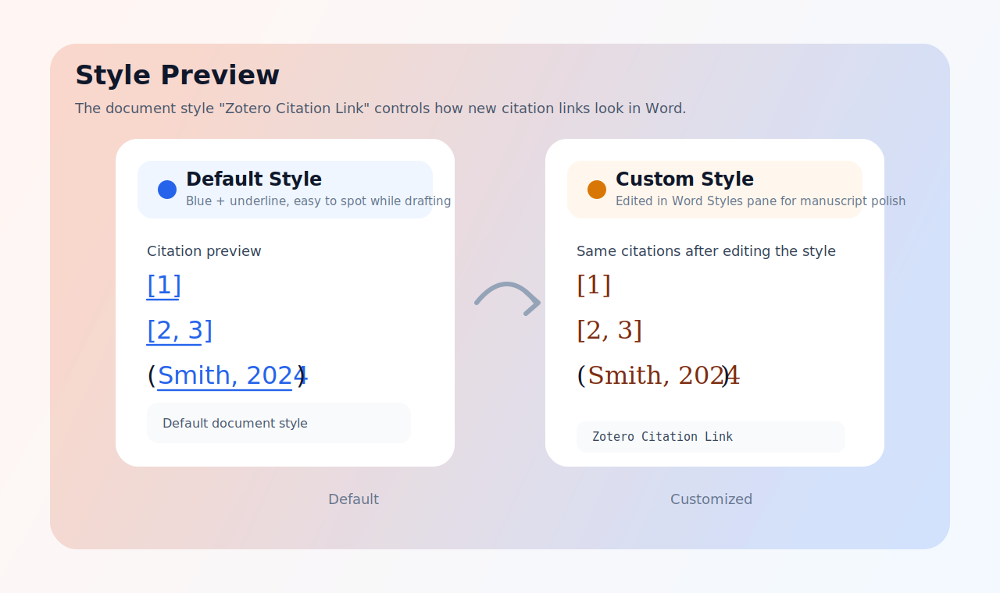

<p align="center">
  
</p>


# Zotero Word Citation Links

> Add clickable citation-to-bibliography links to Zotero citations in Microsoft Word, without disrupting the normal Zotero writing workflow.

<p align="center">
  <a href="https://github.com/FFFxueGawaine/zotero-word-citation-links/releases/latest">
    
  </a>
  <a href="https://github.com/FFFxueGawaine/zotero-word-citation-links">
    
  </a>
  <a href="https://github.com/FFFxueGawaine/zotero-word-citation-links">
    
  </a>
  <a href="https://github.com/FFFxueGawaine/zotero-word-citation-links/blob/main/LICENSE">
    
  </a>
</p>

<p align="center">
  
</p>

Latest release: `v5.0`

Downloads:
- [Latest Release Page](https://github.com/FFFxueGawaine/zotero-word-citation-links/releases/latest)
- [Windows Installer](https://github.com/FFFxueGawaine/zotero-word-citation-links/releases/latest/download/zotero-word-links-installer.exe)
- [Windows Template Package](https://github.com/FFFxueGawaine/zotero-word-citation-links/releases/latest/download/zotero-word-links-windows-template.zip)
- [Mac Template Package](https://github.com/FFFxueGawaine/zotero-word-citation-links/releases/latest/download/zotero-word-links-mac-template.zip)

Changelog: [CHANGELOG.md](./CHANGELOG.md)
Style guide: [docs/STYLE_GUIDE.md](./docs/STYLE_GUIDE.md)
Release workflow: [docs/RELEASE_PROCESS.md](./docs/RELEASE_PROCESS.md)

Jump to: [中文](#zh-cn) | [English](#en)

<a id="zh-cn"></a>

## 中文

[Switch to English](#en)

### 项目简介

这是一个给 `Microsoft Word + Zotero` 使用的小型增强工具。

它会在 Word 的 `Zotero` 选项卡中增加两个按钮：

- `Create Citation Links`
- `Remove Citation Links`

它的目标很简单：

- 让正文中的 Zotero 引文可以点击
- 点击后跳转到文末对应参考文献
- 让链接格式交给当前文档中的字符样式统一控制，不破坏正文段落版式

### 核心特点

| 特点 | 说明 |
| --- | --- |
| 支持数字编号格式 | 例如 `[1]`、`[2, 3]` |
| 支持作者-年份格式 | 例如 `(Smith, 2024)` |
| 入口直观 | 直接出现在 Word 的 `Zotero` 选项卡中 |
| 文档级字符样式 | 自动创建 `Zotero Citation Link` 字符样式来控制链接外观 |
| 安全重建 | 重复执行 `Create Citation Links` 会先清理旧链接，再完整重建 |
| 支持恢复 | 可以移除跳转，也可以恢复原始模板 |

### 支持情况

| 平台 | 状态 | 安装方式 |
| --- | --- | --- |
| Windows + Word | 正式支持 | 一键安装 / 直接复制预改模板 |
| Mac + Word | 实验性支持 | `.command` 一键安装 / 手工安装 |

### 安装前提

- 已安装 `Zotero`
- 推荐使用 `Zotero 8.0`
- 已安装 `Microsoft Word`
- Word 中已经能看到官方 `Zotero` 选项卡

当前项目的日常使用与近期验证，主要基于 `Zotero 8.0` 环境。

## Windows 安装

Windows 现在只保留两种面向用户的安装方式：

1. 一键安装
2. 手动直接复制预改模板

### 方法一：一键安装

这是默认推荐方式，适合大多数用户。

1. 关闭 `Word`
2. 下载并运行 [Windows Installer](https://github.com/FFFxueGawaine/zotero-word-citation-links/releases/latest/download/zotero-word-links-installer.exe)
3. 重新打开 `Word`
4. 打开 `Zotero` 选项卡
5. 确认出现：
   - `Create Citation Links`
   - `Remove Citation Links`

### 方法二：手动直接复制预改模板

如果你更喜欢最简单、最直观的方式，可以直接覆盖预改好的 `Zotero.dotm`。

下载：

- [Windows Template Package](https://github.com/FFFxueGawaine/zotero-word-citation-links/releases/latest/download/zotero-word-links-windows-template.zip)

这个包里包含：

- 预改好的 `Zotero.dotm`
- `install_prebuilt_template.bat`
- `restore_prebuilt_template.bat`
- [windows/WINDOWS_TEMPLATE_INSTALL.md](./windows/WINDOWS_TEMPLATE_INSTALL.md)

你可以用两种方式：

#### 方式 A：运行模板包里的安装脚本

1. 解压 `zotero-word-links-windows-template.zip`
2. 关闭 `Word`
3. 双击 `install_prebuilt_template.bat`
4. 重新打开 `Word`
5. 检查 `Zotero` 选项卡里的两个按钮

#### 方式 B：自己手动复制覆盖

1. 关闭 `Word`
2. 备份当前模板：

```text
%APPDATA%\Microsoft\Word\STARTUP\Zotero.dotm
```

3. 将包内的 `Zotero.dotm` 覆盖到同一路径
4. 重新打开 `Word`
5. 检查 `Zotero` 选项卡中的按钮是否出现

详细说明：
[windows/WINDOWS_TEMPLATE_INSTALL.md](./windows/WINDOWS_TEMPLATE_INSTALL.md)

## Mac 安装

Mac 当前为实验性支持，推荐从模板包开始：

1. 下载 [Mac Template Package](https://github.com/FFFxueGawaine/zotero-word-citation-links/releases/latest/download/zotero-word-links-mac-template.zip)
2. 关闭 `Word`
3. 解压后双击：
   - `install_mac.command`
4. 如果 macOS 首次拦截，右键脚本并选择 `Open`
5. 等待脚本完成备份和安装
6. 重新打开 `Word`
7. 打开 `Zotero` 选项卡，确认出现：
   - `Create Citation Links`
   - `Remove Citation Links`

详细说明：
[mac/MAC_INSTALL.md](./mac/MAC_INSTALL.md)

## 使用教程

### 第一步：正常写作

先按平时的 Zotero 用法写作：

1. 用 Zotero 插入正文引文
2. 用 Zotero 生成参考文献
3. 正常修改、补充、刷新引文

### 第二步：生成跳转

当你的文档已经有了正文引文和文末参考文献后：

1. 打开 Word 的 `Zotero` 选项卡
2. 点击 `Create Citation Links`
3. 文中引文会变成可点击状态
4. 点击引文，可跳转到对应参考文献

### 第三步：先认识自动生成的样式

首次创建链接后，当前文档里会自动出现一个字符样式：

- `Zotero Citation Link`

这一步很重要，因为从现在开始，链接看起来是什么样，主要由这个样式控制。

你可以把它理解成：

1. `Create Citation Links` 负责“生成链接”
2. `Zotero Citation Link` 负责“决定链接长什么样”

### 第四步：把自动生成的样式加入样式库

如果你想以后在 Word 里更容易找到它，推荐把它加入样式库。

操作顺序建议这样：

1. 先至少执行一次 `Create Citation Links`
2. 打开 `开始`
3. 打开右侧或底部的样式窗格
4. 找到 `Zotero Citation Link`
5. 右键它
6. 点击：
   - `添加到样式库`
   - 如果你的界面是英文，通常是 `Add to Style Gallery`

这样做的好处是：

- 以后你不用每次都去样式窗格里翻
- 在 `开始 -> 样式库` 里就能更快看到它
- 更适合经常调格式的人

### 第五步：修改当前文档里的链接样式

首次创建链接后，当前文档里会出现一个字符样式：

- `Zotero Citation Link`

这个样式第一次自动创建时，默认会是蓝色加下划线。

<p align="center">
  
</p>

你可以直接在 Word 的样式窗格里编辑它，例如修改：

- 字体
- 字号
- 颜色
- 粗斜体
- 上下标

之后再次执行 `Create Citation Links`，新建链接就会按这个样式显示。

如果你只是想改当前这篇文档，这是最推荐的方式。

### 第六步：什么时候需要把样式做得更进一步

这里我建议分 3 个等级来理解：

1. 一级：只在当前文档里改  
   最简单，最稳  
   适合大多数人

2. 二级：加入样式库  
   更方便你在当前文档里反复使用和修改  
   适合经常调格式的人

3. 三级：复制到你自己的论文模板里  
   适合已经有固定模板的人  
   这是进阶用法，不建议一开始就做太复杂

如果你想看更详细的教学版说明，包括：

- 怎么打开样式窗格
- 怎么找到 `Zotero Citation Link`
- 怎么把它加入样式库
- 推荐改哪些属性
- 改完后什么时候生效
- 为什么删除链接后不会把样式强留在正文上

可以直接看：

- [docs/STYLE_GUIDE.md](./docs/STYLE_GUIDE.md)

### 第七步：需要时删除跳转

如果你想移除这次生成的跳转效果：

1. 点击 `Remove Citation Links`
2. 文中的跳转会被移除
3. 引文格式会尽量恢复到创建前的状态

### 按钮说明

| 按钮 | 作用 | 什么时候用 |
| --- | --- | --- |
| `Create Citation Links` | 为文中 Zotero 引文创建跳转 | 当引文和参考文献已经准备好时 |
| `Remove Citation Links` | 移除本工具创建的跳转 | 当你想恢复普通显示或重新生成跳转时 |

### 推荐使用节奏

如果你想要最稳的体验，建议这样用：

1. 先完成 Zotero 的正常引文编辑
2. 如果你在 `Zotero` 选项卡里点击 `Refresh`，工具现在会在刷新完成后自动重建链接
3. 如果你手动改了 `Zotero Citation Link` 样式，再点一次 `Create Citation Links`
4. 最后再检查点击跳转效果

原因很简单：

- `Zotero -> Refresh` 会重写 Word 中的引文结果
- 所以现在的 `Refresh` 已经接入了自动重建，避免你再手动补点一次

### 样式使用建议

如果你刚开始用，我建议这样理解：

1. 一级：最稳  
   保持默认蓝色加下划线  
   好处：最容易看出哪里是可点击链接

2. 二级：更像正式论文  
   把 `Zotero Citation Link` 改成深蓝或黑色，并去掉下划线  
   好处：视觉更接近投稿稿件

3. 三级：完全跟随模板  
   让这个样式的字体、字号、颜色都贴近你的正文模板  
   好处：定稿阶段最统一

### 典型效果

数字编号格式：

- `[1]`
- `[2, 3]`

作者-年份格式：

- `(Smith, 2024)`
- `(Kumar et al., 2026; Yu et al., 2025)`

当前设计目标是：

- 数字格式只作用于数字本体
- 作者-年份格式只作用于括号内部正文，括号保持普通样式
- 链接外观由当前文档的 `Zotero Citation Link` 字符样式统一控制
- 重复执行 `Create Citation Links` 会先清理再重建，避免旧链接叠加损坏引文
- 删除后尽量恢复创建前格式，不保留下划线

### 恢复与回退

- Windows 一键安装路线：重新运行安装器，或改用模板包恢复
- Windows 模板包路线：运行 `restore_prebuilt_template.bat`
- Mac：运行 `restore_mac.command`

### 已知限制

- 当前只支持 `Zotero`，不支持 `EndNote`
- 数字模式默认链接数字本体，不是整个括号
- Mac 当前仍是实验性支持，尚未在所有 Mac / Word 版本上完成实机验证
- Zotero 更新后，可能需要重新安装匹配版本

### 仓库结构

- `windows/`
  Windows 预改模板包安装脚本、恢复脚本和说明文档
- `mac/`
  Mac 安装文档和相关说明
- `install/`
  内部安装脚本、宏模块和高级参考文档
- `tools/`
  构建脚本
- `assets/`
  README 头图、logo 和 GIF 展示资源
- `dist/`
  发布资产

<a id="en"></a>

## English

[切换到中文](#zh-cn)

### Overview

This project is a lightweight enhancement for `Microsoft Word + Zotero`.

It adds two buttons to the `Zotero` tab in Word:

- `Create Citation Links`
- `Remove Citation Links`

Its goal is simple:

- make Zotero citations in the document clickable
- jump from an in-text citation to the matching bibliography entry
- keep link appearance under a document-level character style instead of hard-coded color rules

### Key Features

| Feature | Description |
| --- | --- |
| Numeric styles | Supports citations like `[1]` and `[2, 3]` |
| Author-date styles | Supports citations like `(Smith, 2024)` |
| Simple workflow | Use it directly from the `Zotero` tab in Word |
| Document-level character style | Creates `Zotero Citation Link` in the current document to control link formatting |
| Safe rebuild | Running `Create Citation Links` again clears old managed links first and rebuilds them cleanly |
| Reversible | You can remove generated links and restore the original template |

### Support Matrix

| Platform | Status | Install Mode |
| --- | --- | --- |
| Windows + Word | Supported | One-click install / direct prebuilt template replacement |
| Mac + Word | Experimental | One-click `.command` install / manual install |

### Prerequisites

- `Zotero` is installed
- `Zotero 8.0` is recommended
- `Microsoft Word` is installed
- the standard `Zotero` tab is already visible in Word

The current project workflow and recent verification are primarily based on `Zotero 8.0`.

## Windows Installation

Windows now keeps only two user-facing install methods:

1. one-click install
2. manual direct replacement with a prebuilt template

### Method 1: One-click installer

This is the default recommendation for most users.

1. Close `Word`
2. Download and run the [Windows Installer](https://github.com/FFFxueGawaine/zotero-word-citation-links/releases/latest/download/zotero-word-links-installer.exe)
3. Reopen `Word`
4. Open the `Zotero` tab
5. Confirm these buttons are visible:
   - `Create Citation Links`
   - `Remove Citation Links`

### Method 2: Manual direct template replacement

If you prefer the simplest and most transparent route, use the prebuilt `Zotero.dotm`.

Download:

- [Windows Template Package](https://github.com/FFFxueGawaine/zotero-word-citation-links/releases/latest/download/zotero-word-links-windows-template.zip)

This package includes:

- a prebuilt `Zotero.dotm`
- `install_prebuilt_template.bat`
- `restore_prebuilt_template.bat`
- [windows/WINDOWS_TEMPLATE_INSTALL.md](./windows/WINDOWS_TEMPLATE_INSTALL.md)

You can use it in two ways:

#### Option A: Run the package installer script

1. Extract `zotero-word-links-windows-template.zip`
2. Close `Word`
3. Double-click `install_prebuilt_template.bat`
4. Reopen `Word`
5. Check the `Zotero` tab for the two buttons

#### Option B: Copy and replace the template yourself

1. Close `Word`
2. Back up the current template:

```text
%APPDATA%\Microsoft\Word\STARTUP\Zotero.dotm
```

3. Copy the packaged `Zotero.dotm` over that path
4. Reopen `Word`
5. Confirm the buttons appear in the `Zotero` tab

Detailed guide:
[windows/WINDOWS_TEMPLATE_INSTALL.md](./windows/WINDOWS_TEMPLATE_INSTALL.md)

## Mac Installation

Mac support is currently experimental. The recommended path is the template package:

1. Download the [Mac Template Package](https://github.com/FFFxueGawaine/zotero-word-citation-links/releases/latest/download/zotero-word-links-mac-template.zip)
2. Quit `Word`
3. Extract the package and double-click:
   - `install_mac.command`
4. If macOS blocks it the first time, right-click the script and choose `Open`
5. Wait for the script to finish backup and install
6. Reopen `Word`
7. Open the `Zotero` tab and confirm these buttons are visible:
   - `Create Citation Links`
   - `Remove Citation Links`

Detailed guide:
[mac/MAC_INSTALL.md](./mac/MAC_INSTALL.md)

## Usage Tutorial

### Step 1: Write normally with Zotero

Use Zotero as you normally would:

1. insert in-text citations
2. generate the bibliography
3. edit, add, or refresh citations as needed

### Step 2: Create jump links

Once your document already contains in-text citations and a bibliography:

1. open the `Zotero` tab in Word
2. click `Create Citation Links`
3. the citations become clickable
4. click a citation to jump to the matching bibliography entry

### Optional: Edit the link style in the current document

After the first run, the current document will contain a character style named:

- `Zotero Citation Link`

This is an important part of the workflow:

1. `Create Citation Links` creates the links
2. `Zotero Citation Link` controls how those links look

### Optional: Add the generated style to the Styles gallery

If you want easier access in Word, add the generated style to the Styles gallery:

1. run `Create Citation Links` at least once
2. open the `Home` tab
3. open the Styles pane
4. find `Zotero Citation Link`
5. right-click it
6. choose:
   - `Add to Style Gallery`

Benefits:

- easier to find later
- easier to modify repeatedly in the same document
- better for users who tune formatting often

When the style is first created automatically, it defaults to blue text with an underline.

<p align="center">
  
</p>

You can edit that style directly in Word to change:

- font
- size
- color
- bold / italic
- superscript / subscript

Then run `Create Citation Links` again to rebuild links with the updated style.

If you only want to change the current document, this is the recommended path.

### Recommended levels for style control

1. Level 1: change the style only in the current document  
   simplest and safest

2. Level 2: add it to the Styles gallery  
   easier to access and reuse inside the same document

3. Level 3: copy it into your own manuscript template  
   more advanced, best when you already work with a fixed thesis or journal template

If you want the full step-by-step version, including:

- how to open the Styles pane
- how to find `Zotero Citation Link`
- how to add it to the Styles gallery
- what to edit first
- when a style change becomes visible
- why removed links do not intentionally keep the link style

see:

- [docs/STYLE_GUIDE.md](./docs/STYLE_GUIDE.md)

### Step 3: Remove jump links when needed

If you want to remove the generated links:

1. click `Remove Citation Links`
2. the generated jumps are removed
3. citation formatting is restored as closely as possible to the pre-link state

### Button Guide

| Button | What It Does | When to Use It |
| --- | --- | --- |
| `Create Citation Links` | Creates clickable links for Zotero citations | After your citations and bibliography are already in place |
| `Remove Citation Links` | Removes the links created by this tool | When you want to restore normal display or recreate links |

### Recommended Workflow

For the most stable experience:

1. finish your normal Zotero editing first
2. if you click `Refresh` in the Zotero tab, the tool now rebuilds citation links automatically after the Zotero refresh finishes
3. if you manually change the `Zotero Citation Link` style, run `Create Citation Links` again
4. then check the jump behavior

Why:

- `Zotero -> Refresh` rewrites citation results in Word
- so the refresh button now chains directly into a link rebuild for you

### Style Recommendations

Here is the easiest way to think about the style system:

1. Level 1: safest  
   keep the default blue + underline  
   Benefit: the clickable areas are immediately obvious

2. Level 2: more manuscript-like  
   switch `Zotero Citation Link` to dark blue or black and remove the underline  
   Benefit: closer to a formal paper style

3. Level 3: fully template-matched  
   make the style follow your manuscript font, size, and color exactly  
   Benefit: best for final polishing

### Typical Output

Numeric styles:

- `[1]`
- `[2, 3]`

Author-date styles:

- `(Smith, 2024)`
- `(Kumar et al., 2026; Yu et al., 2025)`

Current design goals:

- numeric citations affect only the visible number token
- author-date citations link only the inner text, while keeping outer brackets normal
- link appearance is controlled by the current document character style `Zotero Citation Link`
- repeated `Create Citation Links` runs should clear and rebuild safely instead of stacking links on top of old ones
- removed links should restore the original formatting and leave no underline artifacts

### Restore / Rollback

- Windows installer path: rerun the installer, or switch to the template package restore path
- Windows template package path: run `restore_prebuilt_template.bat`
- Mac: run `restore_mac.command`

### Known Limitations

- Zotero only, not EndNote
- numeric mode links the visible number token rather than the full bracket
- Mac support is still experimental and not fully validated across all Mac / Word versions
- reinstallation may be needed after Zotero updates

### Repository Layout

- `windows/`
  Windows prebuilt template install scripts, restore script, and guide
- `mac/`
  Mac install documentation and support notes
- `install/`
  internal installer scripts, macro module, and advanced reference docs
- `docs/`
  release workflow and maintainer documentation
- `tools/`
  build scripts and release-note sync helpers
- `assets/`
  README banner, logo, and GIF presentation assets
- `dist/`
  release assets

### Release Workflow

For maintainers, GitHub release notes now have a fixed source:

1. write the full bilingual version section in [CHANGELOG.md](./CHANGELOG.md)
2. create or update the tag and GitHub release
3. run the UTF-8 sync script:

```powershell
python .\tools\sync_github_release_notes.py --repo FFFxueGawaine/zotero-word-citation-links --tag vX.Y.Z --token-file D:\Claude\ZoteroWork\.github_token.txt
```

Recommended preview step:

```powershell
python .\tools\sync_github_release_notes.py --repo FFFxueGawaine/zotero-word-citation-links --tag vX.Y.Z --dry-run
```

Do not publish Chinese release notes through a PowerShell here-string piped into `python -`, because that path can turn Chinese into `?` before the text reaches GitHub.

## License

MIT
